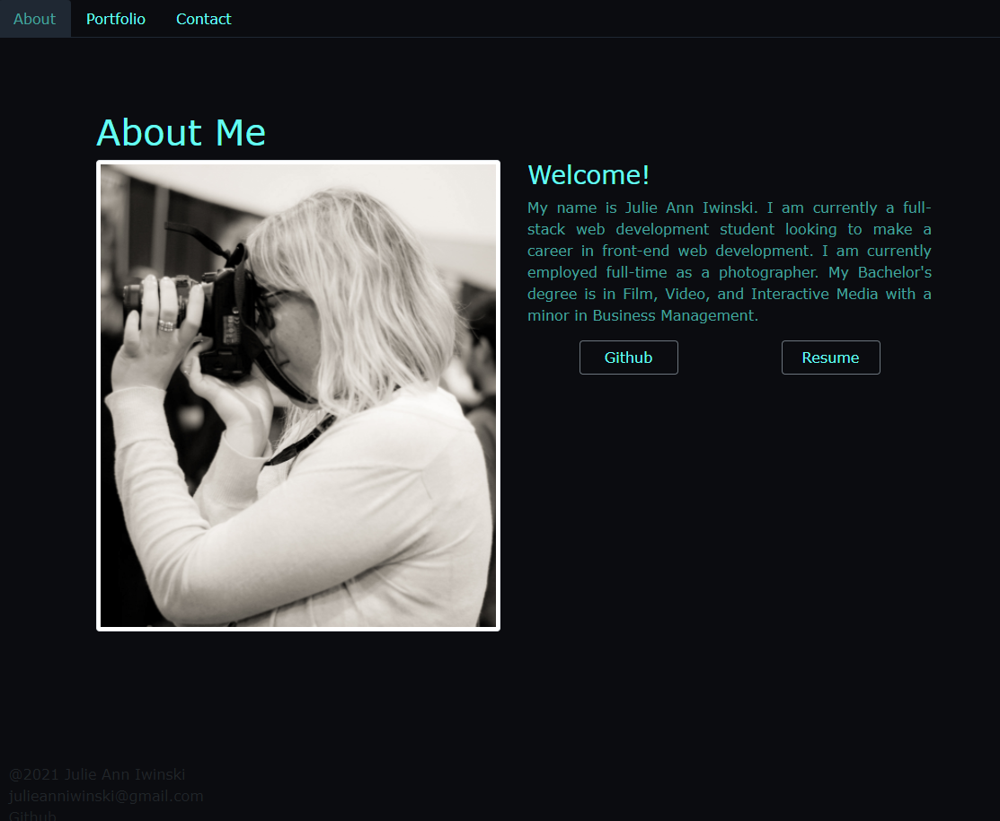
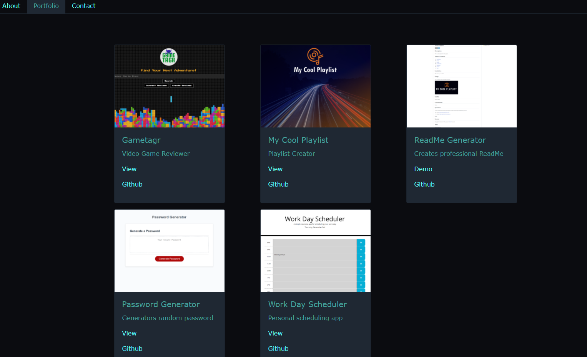

# My React Portfolio
    

  ## Description
  
  This project required me to update my existing portfolio to include new projects while utilizing some of the latest technologies like React and React Router.
  
  ## Table of Contents
  
  - [Installation](#Installation)
  - [Usage](#Usage)
  - [Credits](#Credits)
  - [Contributing](#Contributing)
  - [Questions](#Questions)
  - [License](#License)
  - [Tests](#Tests)
  
  ## Installation
  
  Please follow the [link]() to view my portfolio. If you would like to view it locally please fork this repo. Once you have downloaded it to your local machine "npm install" inside the repo folder. Then use command "npm start" to view my portfolio.
  
  ## Usage
  
  Updating my portfolio is building towards being employer competitive. Creating a portfolio using React will help set me apart from other developers who do not use latest technologies in their portfolios. Having a place to share my projects is critical to my journey as a developer.

   
  
  
  ## Credits
  
  Thank you to my instructor and TAs whose guidance and lessons make all of my project possible. Thank you to my fellow peers who also provide inpirations and encouragement. 
  
  ## Contributing 
  
  Feel free to contribute to this project in any constructive way you see fit.
  
  ## Questions
  
  To ask questions about this project please contact me through the following sources:
  - Email: julieanniwinski@gmail.com
  - Github:  https://github.com/JulieAnnI
  
  
  
  ## License
  
  Copyright (c)  JulieAnnI.
    This project is [MIT](https://opensource.org/licenses/MIT) licensed.
  
  ## Tests
  
  None currently.